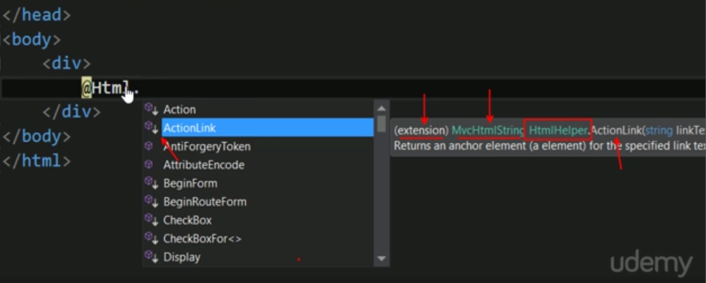

## RAZOR KULLANIMI

### 1) Razor Syntax
- View Engine nedir?
    - View’lerinizi HTML çıktısı olarak render etmek için kullanılan bir mekanizma/teknoloji’dir.
- RazorView Engine nedir?
- Razor Bloğu açma ve içine C# kodları yazma
- Razor içinde oluşturulmuş verilere view içinde erişme
- Razor açıklama satırı
- Parantez içinde iki değişkenin birleştirilmesi  
- View içinde for – foreach – if – else kullanımı

#### Razor içinde html yapısı kullanırken oluşan hatalar
- Razor yapılarından biri kullanıldığında, hemen içine normal yazı yazıldığında bunu C# dili olarak algılar. Eğer yazdığımız bu kısım C# değilse bize hata verecektir.

```cs
@if (true)
{
    Lorem Ipsum // Bu kısım hata verecektir!
}
```

- Bu hatayı vermemesini sağlamak için bir kaç yöntem vardır:
    - Bir html tagı kullanmak
    - `@:` Razor hata bastırma kodu kullanmak
    - `<text> </text>` taglarını kullanmak.

```html
@if (true)
{
    <span> Lorem Ipsum </span>
    
    @: Lorem Ipsum
    
    <text>
        Lorem Ipsum
        Lorem Ipsum
    </text>
}
```

### 2) HTML Helpers
- HTML Helpers nedir? 
- Bizim yazdıklarımız ve istemciye ulaşan html verisi arasındaki ilişki
- @Html.{ActionLink}
- Overload Functions ve Kod yapısı içinde override functionsların görülmesi

### 3) Custom HTML Helper Methot Oluşturma
- HtmlHelper class’ı içine oluşturulmuş extension’lar

<p align="center">
    
</p>

- Kullanılışı :	
    - Bir klasör içinde ( Library ) class dosyası ( extensions ) oluşturulur.
        - Bu kısım zorunlu değil, fakat dosyaların düzgün bir düzende olması için böyle yapılması daha uygun olur.
    - Model static yapılmak zorunda
    - Class içine statik bir fonksiyon oluşturulur.
    - Fonksiyonun return’ü -> MvcHtmlString
    - Fonksiyonun kalıtımı -> ( this HtmlHelper helper )
    - String olarak html hazırlanır.
    - Return MvcHtmlString.Create( string htlml_metni )
    - Kullanılacak sayfada using ile Library klasörüne link verilir.

```cs
using System.Web.Mvc;

namespace Project.Library
{
    public static class MyExtensions
    {
        public static MvcHtmlString Submit(this HtmlHelper helper, string text)
        {
            string html = $"<input type='submit' value='{text}' />";
            return MvcHtmlString.Create(html);
        }
    }
}
```
- - Html içinde bu oluşturduğumuz fonksiyon şu şekilde kullanılır:

```html
@using Project.Library
---
<form method="post">
    @Html.Submit("Kaydet")
</form>
```

- Custom Html metot içinde html kullanma
    - Bazen yazdığımız helper method içinde sadece parametre yazmak işimizi görmez. Bunun yerine parametre olarak html vermek isteyebiliriz. 
    - Bunun için kullanacağımız yöntemde, html alacağımız parametreyi fonksiyon olarak belirtip, daha sonda invoke edip string formatına çeviriyoruz.

```cs
public static MvcHtmlString CreateParagraf(this HtmlHelper helper, int borderSize = 3, string borderType = "solid", Func<object, HelperResult> template = null)
{
    string html = $"<p style='border-width:{borderSize}px;border-style:{borderType}'>{template.Invoke(null)}</p>";
    return MvcHtmlString.Create(html);
}
```

- - Kulnanımı:

```html
@using Project.Library
---
@Html.CreateParagraf(2, "solid", @<text>
    Lorem ipsum.
</text>)
```


### 4) Custom Helper Methods
- Projelerimiz içinde, Html Helper methotlar gibi, kendimiz de metodlar oluşturabiliriz.
- Bunun için öncelikle özel bir klasör yapısı olan “App_Code” adlı bir klasör eklememiz gerekiyor.
    - Projeye sağ tıklıyoruz.
    - Add > Add Asp.Net Folder > App_Code
- Klasör içinde boş bir cshtml dosyası oluşturup içinde istediğimiz kodları yazıyoruz.
- App_Code dizini özel bir dizin olduğu için bu dizini using olarak belirtmeye gerek yoktur. Otomatik olarak bu using ve içindekiler tanınacaktır.

```html
<!-- App_Code/Extensions.cshtml -->
@helper Input(string name, string type, string val)
{
    <input type="@type" name="@name" value="@val" />
}
``` 

- - Kullanımı:

```html
<!-- Herhangi bir using ifadesi kullanmaya gerek yok. -->
@Extensions.Input("name", "text", "value")
```

### 5) URL Helpers
- Html.ActionLink()
- Url.Action()

### 6) HttpUtility Helpers
- HttpUtility.HtmlEncode() 
- HttpUtility.HtmlDecode()
- HttpUtility.UrlEncode() 
- HttpUtility.UrlDecode()
- Html.Raw()
