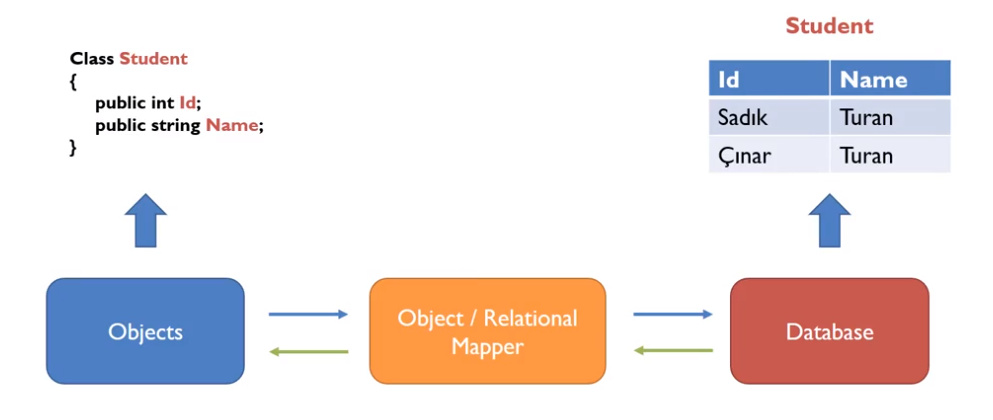
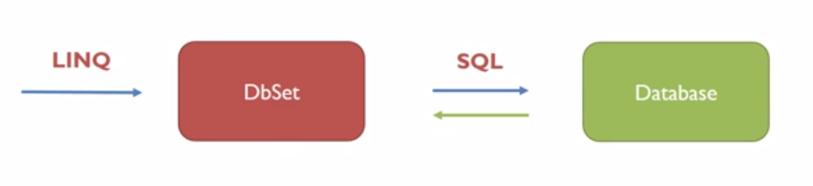

## ENTITY FRAMEWORK CODEFIRST ENTEGRASYONU

### 01 – ORM (Object Relational Mapping) Nedir?
- İlişkisel veritabanı (RDBMS) ile nesneye yönelik programlanın (OOP) arasında bir tür köprü özelliği gören ve ilişkisel veritabanındaki bilgilerimizi yönetmek için, nesne modellerimizi kullandığımız bir tekniktir/metodtur.
- Database işlemleri öncelikle bu katmanda gerçekleştirilir, sonra database üzerine SaveChanges yapılır.
    - Transaction Özelliği
    - Bu sayade verilerin CRUD işlemlerinde herhangi bir hata çıkması sonucu oluşan yarıda kesilme ve verilerin bir kısmının db üzerine kayıt edilmesi sorunu ortadan kalkar.
    - Veriler biz `SaveChanges()` metodunu çalıştırmayana kadar db üzerine kaydedilmez.
    - Bu yüzden işlemler bittiğinde bu metodun çalıştırılması unutulmamalıdır.

<p align="center">
    
</p>

<p align="center">
    
</p>

### 02 - Code First (Önce Kod)
- Projelerde DB kullanırken bunu iki şekilde yapabiliriz.
    1. DB First : Öncelikle db tasarlanır ve ilgili db üzerinde tablolar oluşturulur. Daha sonrasında bu tablo yapıları program içinde çekilerek (ADO.NET ile) üzerinde CRUD işlemleri yapılır.
    2. Code First : DB tasarımı yapıldıktan sonra, bu yapılar OOP yapısına uygun olarak modellenir, daha sonra bu modeller üzerinden db tabloları ilgili database üzerinde oluşturulur.
- Code First yapısında database oluşturmadan önce;
    - Database modelleyen classların ( entities ) oluşturulması
    - Database bağlantılarını barındıran ProjectContext classının oluşturulması
    - En son db oluşturma

### 03 – Veritabanı Sınıflarını ( Entities ) Oluşturma
- Tabloları oluştururken `models` dizini kullanılabileceği gibi, yeni bir class library projesi de açılarak modellemeler oluşturulabilir.
- Modellemeler oluşturulurken dikkat edilmesi gerekenler:
    - Her modelin bir ID'si olmalıdır.
    - Modeller içinde foreign key bağlamaları varsa, bu foreign key ID'leri ayrıca tekrar yazılmalıdır. Bu işlem CRUD işlemlerinde kolaylık sağlamaktadır.
    - Modeller bittiğinde validation kısımlarının da yazıldığına emin olunulmalıdır.
    - Database üzerine tablolar oluşturulurken tablo isimlerini custom olarak girmek istiyorsak, clas üstüne attribute olarak `[Table(<tablo_adi>)]` yazılabilir.
- Tablolar arasındaki ilişkileri tanımlama
    - Bire bir ilişki – YOK
    - Bire çok ilişki
    - Çoka çok ilişki
- Virtual anlamı ve nullable veri tanımlama

### 04 – Veritabanı İşlemlerini Yönetecek Sınıfı ( Context ) Oluşturma
- Nuget Manager üzerinden `Entity Framework` kütüphanesinin kurulması gerekiyor.
- Context sınıfı models dizini altında oluşturulacaksa, `DAL` adlı bir dizin oluşturup içinde oluşturmak, entity modellerle karıştırılmaması açısından daha uygundur. Bunun dışında ayrı bir `class library` projesi eklenerek de context sınıfı burada oluşturulabilir.
- Context sınıfı `DbContext` sınıfından kalıtım almalıdır.
- Context sınıfı oluşturulurken iki adımdan oluştuğuna dikkat edilmelidir.
    1. DB bağlantısını oluşturulması
    2. İlgili modellerin bağlanması

```cs
using System.Data.Entity;

namespace Project.Models.DAL
{
    public class ProjectContext : DbContext
    {
        public ProjectContext()
        {
            Database.Connection.ConnectionString = "SERVER=. ; DATABASE=deneme ; UID=sa ; PWD=123";
        }

        public DbSet<Person> Persons { get; set; }
    }
}
```

#### DB Bağlantısının Oluşturulması
- Database bağlantısı için bir `connection string`'e ihtiyacımız vardır.
- MSSQL için bu bağlantı string'i:
    - `"SERVER=<server_adı> ; DATABASE=<db_adı> ; UID=<kullanıcı_adı> ; PWD=<parola>"`
    - Buradaki bilgiler MSSQL kurulurken oluşturulan bilgilerdir.
    - Database girişinde windows auth ile giriş sağlanıyorsa, UID ve PWD yerine `Integrated Security=true` yazılarak giriş yapılabilir.
- Bu bağlantı kısmını, context sınıfımız içinde oluşturduğumuz constructor metot içinde tanımlıyoruz.
- Alternatif yol olarak, `Web.Config` içinde de bu tanımlama yapılabilir.

```html
<connectionStrings>
    <add name="ProjectContext"
    providerName="System.Data.SqlClient"
    connectionString="Server=.; Database=Test; User Id=sa; pwd=123"/>
  </connectionStrings>
```

- Bu adımlardan sonra proje çalıştırılıp, CRUD işlemlerinden biri yapıldığında, otomatik olarak db oluşturulacaktır.
- Alternatif olarak aşağıdaki migration işlemleri yapılıp da database oluşturulabilir.

#### Modellerin bağlanması
- Database üzerinde tablo olarak bulunmasını istediğimiz ve daha öncesinde tanımladığımız modelleri, Context dosyamız içinde property olarak belirtmemiz lazım.
- Bu property girdilerinin tiplerinin `DbSet<model>` olmasına dikkat edilmelidir.
- Model isimlendirmesi yapılırken, çoğul ifadelerin kullanılması, yazım açısından daha iyi olacaktır.
- Buradaki isimlendirmeler, db üzerindeki tablo isimlendirmesi olarak **kullanılmaz.** Tablo isimlendirmeleri, eğer yukarıda bahsedildiği gibi modeller oluşturulurken belirtilmemişse, model isminin sonuna `-s` takısı alınarak oluşturulur. İstenilirse bu kısım için context dosyası içinde şöyle bir override metot da yazılabilir:

```cs
protected override void OnModelCreating(DbModelBuildermodelBuilder)
{
    modelBuilder.Conventions.Remove<PluralizingTableNameConvention>();
    base.OnModelCreating(modelBuilder);
}
```

#### Örnek Databse Verilerinin Oluşturulması
- Kodlar aşağıdaki gibi düzenlenerek ilk database oluştuğunda örnek verilerin db üzerinde kayıt edilmesi sağlanabilir.

```cs
public class ProjectContext : DbContext
{
    public ProjectContext()
    {
        Database.Connection.ConnectionString = "SERVER=. ; DATABASE=deneme ; UID=sa ; PWD=123";
        Database.SetInitializer(new SampleDb());
    }

    public DbSet<Person> Persons { get; set; }

    public class SampleDb : CreateDatabaseIfNotExists<ProjectContext>
    {
        protected override void Seed(ProjectContext context)
        {
            // Örnek verileri girme
        }
    }
}
```

- **NOT:** Bu yöntem sadece db otomatik olarak kendisi oluştuğunda çalışacaktır. Aşağıdaki migration işlemleri yapıldıktan sonra `Update-Database` komutu girilerek db oluşturulursa bu yöntem çalışmaz.
- Bu yöntemin alternatifi olarak, `Global.asax` içinde çalıştırılacak bir metot yazılabilir. Böylece proje ilk çalıştığında, Global.asax içindeki metot çalışacak ve db içinde ilgili alanlar yoksa ekleyecektir.

### 05 - Migration İşlemleri
- Migration işlemleri, database ile modellerimizin arasındaki farkın bulunması ve database güncellenmeden önce hangi işlemlerin yapılacağının çözümlendiği işlemdir.
- Migration işlemlerinde yazılacak kodlar `Nuget Package Console` üzerinde çalıştırılır.
- Migration işlemleri yapılmadan önce, migration dizininin oluşturulması için `Enable-Migrations` kodu çalıştırılmalıdır. Böylece migrations diye bir dizin ve altında migration ayarlarının bulunduğu bir settings dosyası oluşacaktır.
- Her model değişikliğinden sonra ve db güncellemesinden önce `Add-Migration` kodu çalıştırılarak, migration dosyası oluşturulmalıdır. Yukarıda belirttiğimiz gibi, bu migration işlemi, db ile bizim modellerimiz arasındaki farkı bulma işlemidir. Bu işlemden sonra Migrations dizininin altında, verdiğimiz isimde bir migration dosyası oluştuğunu görürüz.
- Migration işlemleri bittikten sonra, db güncellemesi için `Update-Databse` komutu çalıştırılmalıdır. İstenilirse sonua 
    - `-Vebrose` getirilerek yapılan SQL sorgularının içeriği görülebilir,
    - `-TargetMigration: <mig_name>` getirilerek bizim belirlediğimiz bir migration işlemini yapması sağlanabilir,
    - `-Force` getirilerek, databese veri kayıplarını görmezden gelmesini sağlayabiliriz.
- Eğer her database güncellemesinde Add-Migration diyerek migration eklemesini yapmak istemiyorsak, bunu iki yöntemle otomatik hale getirebilir.
    1. Migration dizini altındaki `Configuration.cs` dosyası içindeki `AutomaticMigrationsEnabled = false;` kısmını `true` hale getirebilir.
    2. Migration dizinini oluştururken çalıştırdığımız kodu `Enable-Migrations -EnableAutomaticMigrations` şeklinde yazarak bu kısmın otomatik true olarak gelmesini sağlayabiliriz.

```cs
// Summary Codes
Enable-Migrations
Add-Migration
Update-Database

Update-Database -Verbose 
Update-Database -TargetMigration: <Mig.Name>
Update-Database -Force

Enable-Migrations -EnableAutomaticMigrations
```